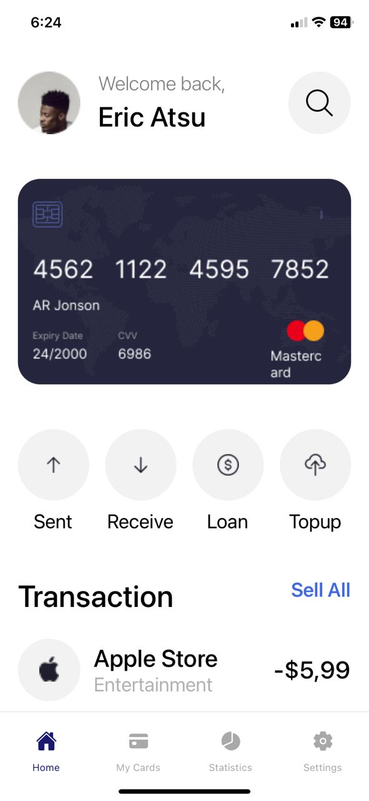
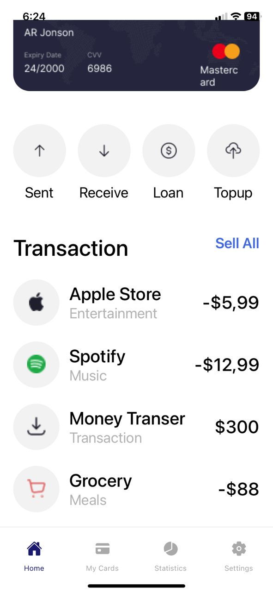
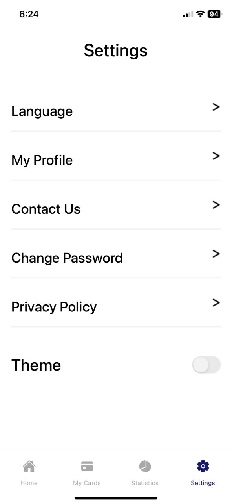
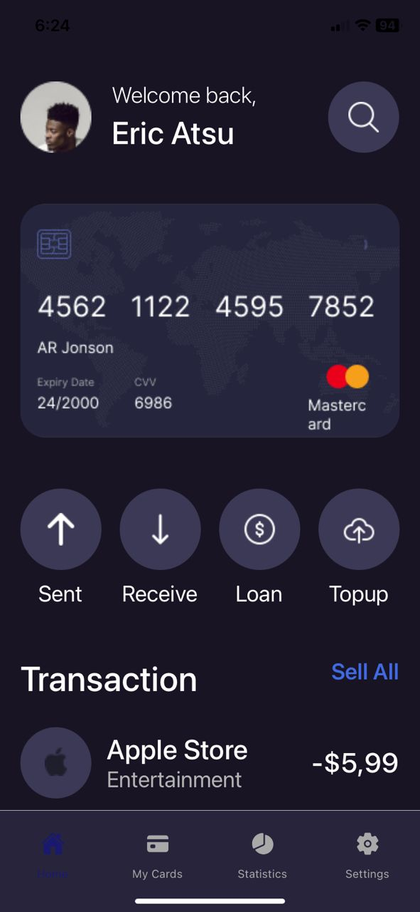
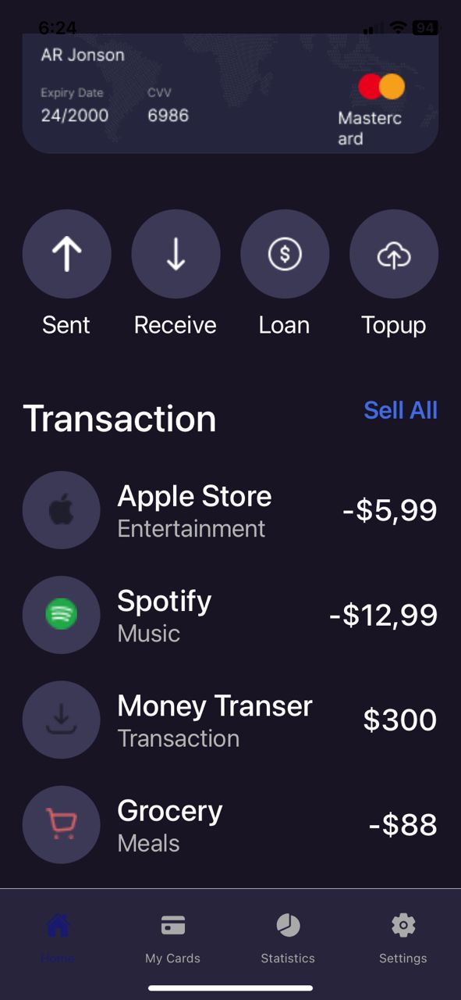
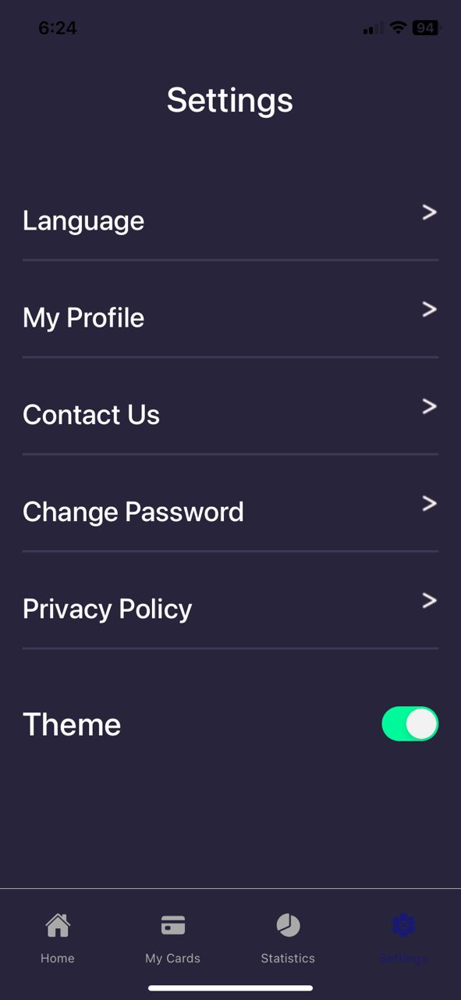

# rn-assignment5-11015648 - FinTrack

## Description

This is a simple app that allows users to track their finances. Users can add expenses and incomes,
and see their current balance. The app also allows users to set a budget and see how much they
have spent so far. The app is built using React Native and Expo, and uses the Expo SDK.

### Building Process

- Downloade the UI MockUp from the Google Drive
- Downloade all necessary assets from the Google Drive folder
- Create the GitHub repository, and cloned it to my local machine
- Create the React Native app using the Expo CLI
- Create the screens in a separate folder
- Create the bottom tab navigator to navigate between screens
- Build the screens
- Create the themes for each page
- Check through and adjust any incorrect UI rendering

### Screenshots of FinTrack

